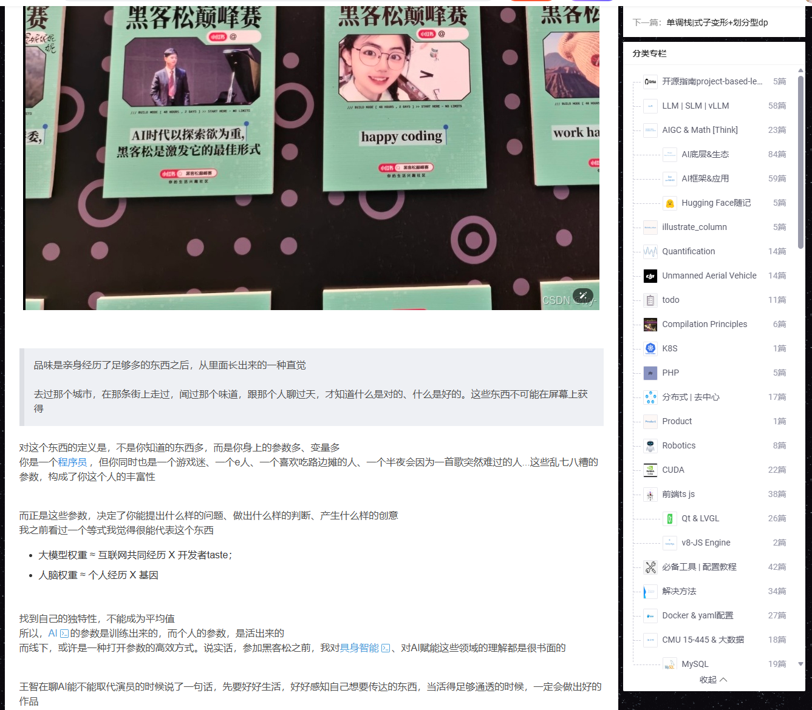

## 线下 48h 黑客松初体验

> 这是一篇拼拼凑凑的碎碎念，只记得50h多没睡... 活动领悟.快速迭代解决问题+干中学

### 相关记录

[或许你需要一个假维斯？（视频）](https://www.bilibili.com/video/BV1kYDfBaEkS/?spm_id_from=333.1387.list.card_archive.click&vd_source=1ace6c545a2f11779a002209211e9e26)
首次黑客松实录 — team 最强大脑 lead@[艺雨YiLight](https://xhslink.com/m/9dX1mJQUX4X)

[黑客松初体验（图文）](https://www.xiaohongshu.com/discovery/item/69dc7ce6000000001d01d313?source=webshare&xhsshare=pc_web&xsec_token=ABRjVdNQE6CKhaDV8wjAv3JqOsv3ixf8lbIyiB9PE_u14=&xsec_source=pc_share)

日记写了几千个字话太多了(感觉需要整理组织一下再公开


关于项目赛场、宣传海报和各种介绍还没整理🕊😇

上面的自媒体笔记神秘运营需求发的，活动后才发现发现错过了 10086 个集邮机会和流量，活动时注意力全点了技术点...

翻到赛时ddl ai写的一个文档↓

### Jarvis — 主动式 AI 感知伙伴

> **"让 AI 从回答问题，进化为主动操控现实。"**


| 项目信息     | 详情                              |
| -------------- | ----------------------------------- |
| **项目名称** | Jarvis（最强大脑）                |
| **项目状态** | 闭源内测中                        |
| **当前平台** | macOS                             |
| **核心架构** | Input → Brain → Output 三层架构 |

---

## 一、项目概述

### 1.1 我们是谁

我们是一群不满足于"你问我答"的 AI 极客。我们相信 AI 应该像钢铁侠的 Jarvis 一样**主动感知世界**，用 Agent 做大脑，让 AI 从"回答问题"进化为"主动操控现实"。

### 1.2 项目愿景

打造一个**常驻运行的 AI 伙伴**——通过摄像头、截屏、麦克风、浏览器持续感知用户环境，不用你开口，它就能看到你在做什么，主动给出上下文相关的帮助，从 **"观察 → 推理 → 行动"** 形成完整闭环，并通过反馈不断学习你的偏好。

---

## 二、问题与动机

### 2.1 行业痛点


| 痛点           | 描述                                               |
| ---------------- | ---------------------------------------------------- |
| **被动交互**   | 现有 AI 助手全部在"等指令"，缺乏主动感知能力       |
| **上下文断裂** | 每次对话都要重新描述场景，效率极低                 |
| **信息过载**   | 多任务并行时，用户被大量信息淹没，重复操作浪费时间 |
| **思路打断**   | 开发者写代码时频繁切换查资料，上下文被打断思路全丢 |

### 2.2 核心解决的问题

> 核心解决 **"AI 等你开口"** 的被动交互问题。

- 让 AI 像真正的伙伴一样，**看见你在做什么就主动帮忙**
- 通过偏好学习系统，**越用越懂你**，减少无效打扰

---

## 三、目标用户

### 👨‍💻 开发者 / 创作者


|          | 详情                                                      |
| ---------- | ----------------------------------------------------------- |
| **痛点** | 写代码时频繁切换查资料，上下文被打断思路全丢              |
| **方案** | Jarvis 实时感知屏幕和语音，主动浮窗推送代码建议和参考文档 |

### 🖥️ 重度电脑办公人群


|          | 详情                                                       |
| ---------- | ------------------------------------------------------------ |
| **痛点** | 多任务并行信息过载，重复操作浪费大量时间                   |
| **方案** | Jarvis 后台每 10-15 秒观察一轮，主动识别意图并提供即时帮助 |

---

## 四、系统架构 — Input / Brain / Output

Jarvis 采用清晰的**三层架构**设计，实现从感知到行动的完整闭环：

```
┌─────────────────────────────────────────────────────────┐
│                    🧠 BRAIN 层                          │
│              Reactor 引擎（单次 LLM 调用）                │
│          感知融合 → 意图推理 → 行动决策（一次搞定）         │
│                                                         │
│   ┌──────────────────────┐  ┌────────────────────────┐  │
│   │   偏好学习系统a2a     │  │   preferences.json     │  │
│   │   (反馈驱动自动进化)   │  │   (用户画像持续更新)    │  │
│   └──────────────────────┘  └────────────────────────┘  │
└──────────▲──────────────────────────────┬───────────────┘
           │                              │
           │ 统一上下文流                   │ 行动指令
           │                              ▼
┌──────────┴──────────┐       ┌───────────────────────┐
│   📡 INPUT 层       │       │   📤 OUTPUT 层         │
│   (多模态感知)       │       │   (交互与执行)         │
│                     │       │                       │
│  📷 OpenCV 摄像头    │       │  💬 macOS 原生浮动面板  │
│  🖥️ 桌面截屏        │       │     (NSPanel+WKWebView │
│  🎤 讯飞 ASR 语音   │       │      不抢焦点)         │
│  🌐 浏览器历史       │       │  👍 反馈闭环           │
└─────────────────────┘       │     (点赞/关闭/语音评价 │
                              │      /超时信号)         │
                              └───────────────────────┘
```

### 4.1 📡 Input 层 — 多模态感知

负责持续采集用户环境的多维信号，构建实时上下文：


| 传感器通道    | 技术实现       | 采集内容               |
| --------------- | ---------------- | ------------------------ |
| 📷 摄像头     | OpenCV         | 用户面部状态、物理环境 |
| 🖥️ 桌面截屏 | 系统级截屏 API | 当前屏幕内容、工作状态 |
| 🎤 语音识别   | 讯飞 ASR       | 用户语音指令、对话内容 |
| 🌐 浏览器历史 | 浏览器数据接口 | 用户浏览行为、搜索意图 |

> 四路信号融合为**统一上下文流**，送入 Brain 层处理。

### 4.2 🧠 Brain 层 — Reactor 推理引擎

Jarvis 的核心大脑，采用独创的 **Reactor 架构**：

- **单次 LLM 调用**：一次调用同时完成感知理解、意图推理和行动决策，延迟极低
- **多模态上下文融合**：将四路传感器数据融合为统一上下文，全局理解用户状态
- **偏好学习系统**：基于 `preferences.json` 持续记录用户反馈，自动进化用户画像
- **智能决策**：根据上下文判断是否需要介入、以何种方式介入，减少无效打扰

### 4.3 📤 Output 层 — 交互与执行

将 Brain 层的决策以最低干扰的方式呈现给用户：

- **macOS 原生浮动面板**：基于 `NSPanel + WKWebView` 实现，不抢焦点，体验丝滑
- **反馈闭环机制**：支持多种反馈信号
  - 👍 点赞 — 标记有用建议
  - ❌ 关闭 — 标记无效打扰
  - 🎤 语音评价 — 自然语言反馈
  - ⏱️ 超时信号 — 隐式负反馈
- 所有反馈回传至 Brain 层，驱动偏好学习系统持续优化

---

## 五、技术亮点


| 亮点                   | 说明                                                      |
| ------------------------ | ----------------------------------------------------------- |
| 🔄**Reactor 单次调用** | 感知 + 推理 + 行动一次 LLM 调用搞定，延迟极低             |
| 📡**四路多模态融合**   | 摄像头 + 截屏 + 语音 + 浏览器数据流首次同时在线并成功汇聚 |
| 🪟**原生浮动面板**     | macOS NSPanel + WKWebView 不抢焦点，零干扰体验            |
| 🧠**偏好自动进化**     | preferences.json 基于反馈闭环持续学习，越用越懂你         |
| 🔁**完整闭环**         | 观察 → 推理 → 行动 → 反馈 → 学习，形成自我进化循环    |

---

## 六、项目里程碑

### ✅ 已完成（黑客松阶段）

- [X] Reactor 架构验证成功，单次 LLM 调用跑通感知+推理+行动
- [X] 四路传感器（摄像头/截屏/语音/浏览器）同时在线，数据流成功汇聚
- [X] macOS 原生浮动面板（NSPanel + WKWebView）首次弹出，不抢焦点
- [X] 反馈闭环跑通（点赞/关闭/语音评价/超时信号）
- [X] preferences.json 偏好学习系统开始自动进化
- [X] 核心闭环验证：多模态感知 → Reactor 单次推理 → 浮动面板展示 → 反馈学习

### 🔜 下一步计划

- [ ] **更多传感器接入**：扩展感知维度
- [ ] **多 Agent 协作**：支持多个 Agent 协同工作

---

## 七、长期愿景

> 🚀 **让每个人都拥有自己的 Jarvis，AI 从工具进化为伙伴。**

我们的目标是打造真正的**主动式 AI 操作系统**——

- 从"建议"到"操作"，真正操控现实
- 从单平台到全平台，无处不在
- 从单 Agent 到多 Agent 协作，能力无限扩展
- 让 AI 不再是冰冷的工具，而是懂你、陪你、帮你的**数字伙伴**

---

## 八、项目状态


| 状态项       | 当前情况                              |
| -------------- | --------------------------------------- |
| **开源状态** | 🔒 闭源内测                           |
| **支持平台** | macOS（优先）                         |
| **核心架构** | Input → Brain → Output 三层架构     |
| **核心引擎** | Reactor（单次 LLM 调用）              |
| **感知通道** | 4 路（摄像头 / 截屏 / 语音 / 浏览器） |
| **交互方式** | macOS 原生浮动面板                    |
| **学习机制** | 基于反馈的偏好自动进化                |

---

<p align="center"><b>🤖 Jarvis — 你的主动式 AI 伙伴，不用开口，它已看见。</b></p>
