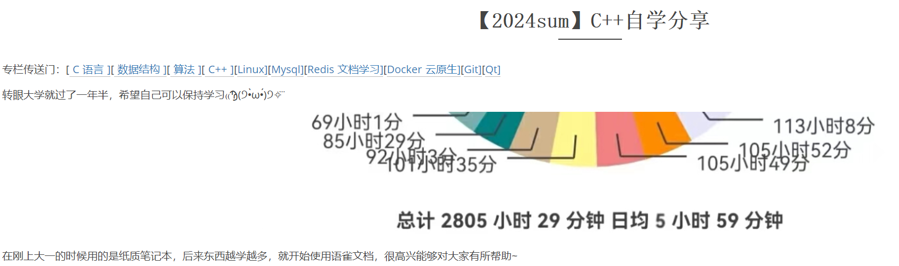
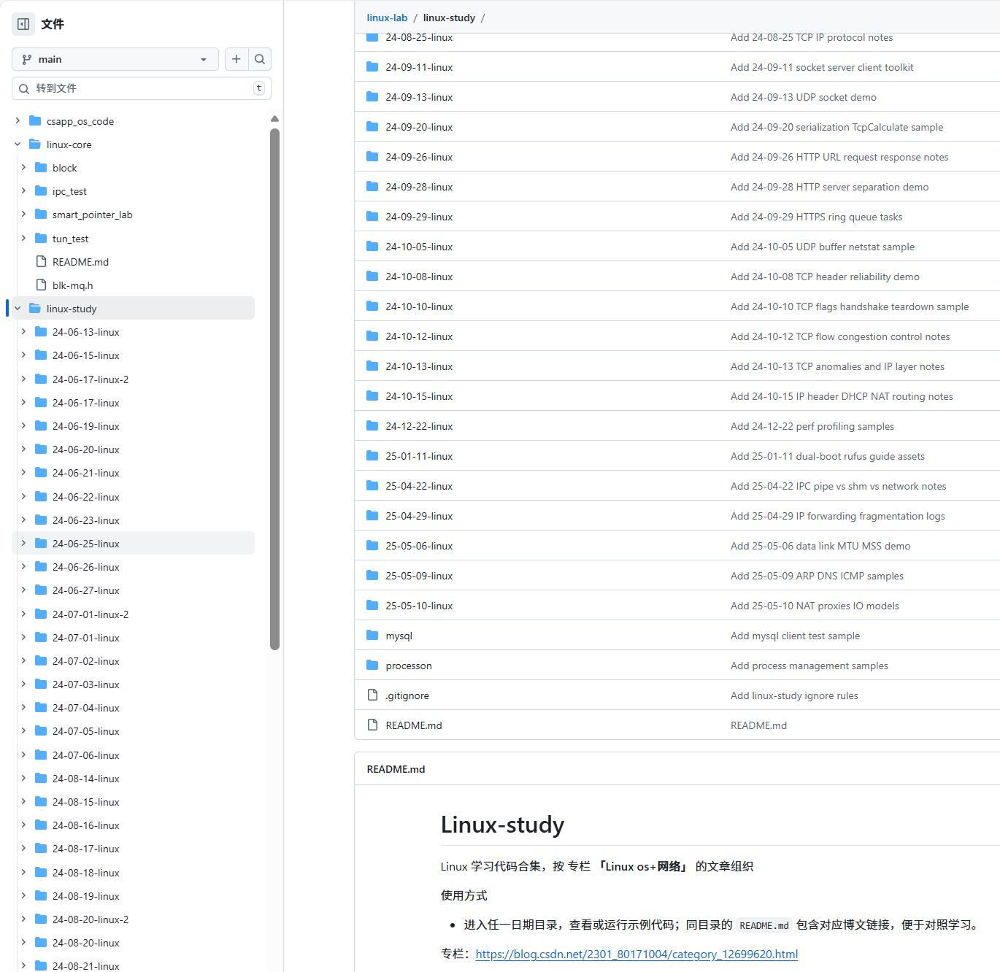
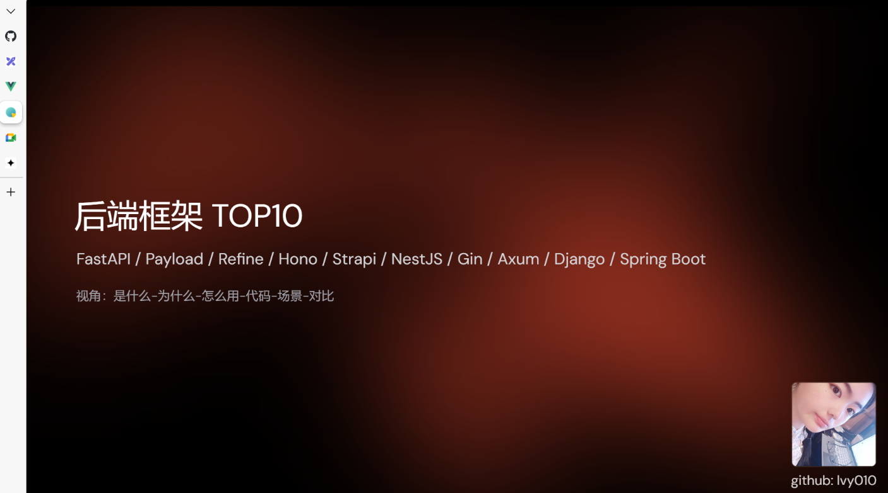
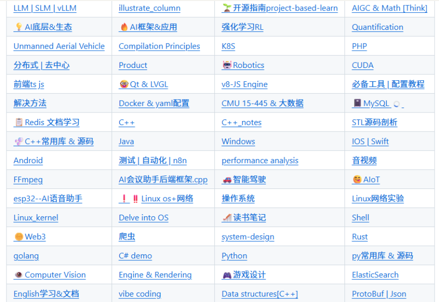

这篇作为[2025年末总结]的预告吧，2024的总结感兴趣可以见博客置顶文章



先叠一下甲，是普通学生 | 爱好流 | 编程之大学摸鱼法：上课用手机摸/睡觉，下课用电脑/熬夜摸...

上一篇文章**Re:Algo - Starting Algorithms from Zero**收到了一些交流邮件

把被提到的仓库代码简单整理了一下，主要是前年的linux部分，整理了应该有1/5，后续准备把剩下的4/5整理出来，博客是根据代码思考写的，这样看文章想跑一下代码，把仓库`clone`下来就行




github主页放的项目是一年多前写的简单项目，适合用C++写项目入门，项目重构了一半，去做别的事情了，大家感兴趣欢迎提pr/issue。平时用到仓库clone时会习惯fork一份，所以有比较多的仓库...后续应该会把做过的demo都完善后列出list

最近在用`rust`做后端，对web3infra server restructures,  暑假主要做的`偏C和图形学`，Contributed to Xiaomi OpenVela open-source project by adding a `music player` feature. 如果好奇开源`Like coding`&`Curious about computer science`就可以去做啦，预祝大家都可以找到自己感兴趣的事情

b站开的小号，准备跟上时代尝试做一些视频，目前是一些二次元为爱发电...学习视频正在开发中，初步做了一个演示文稿，这个选题是想到在做技术选型的时候，我们需要了解到一些常见的框架才能做出正确的选择，在看一些框架的同时，不断思考总结如何写出一个好的框架，在不断借鉴学习中或许还可以写出一个自己的框架给他人使用🤓



演示用的Slide(前端版ppt.md)，根据使用在尝试自动化这个流程，欢迎star/提pr/issue[lvy010/Next-AI-Slide: 🤖 Generate Slidev presentations with AI](https://github.com/lvy010/Next-AI-Slide)

之前做的主要是文字分享，七月前用的博客账号，现在主要用于随手复习记录，自言自语了，七月后本地笔记的文章backsup到了`lvynote.github.io`，文章.md可直接clone repo获取。github上也有收录，可以根据 `X-Plore` repo的整合目录跳转看需要的文章，文章太多了直接翻可能不太好翻



---

可能也会建一个仓库 整理一些计算机之外的东西~~完全把github当云端了~~ 一些关于事情的理解与思考 写东西使我快乐 活着就会一直写下去

附录：一些回复的邮箱问题节选

## 如何了解大模型 Infra 而不是只会调 API？

nano project ：精简版大模型基础设施学习路径

避免被生产级框架的复杂代码干扰，**"先建立宏观脉络 → 学核心小项目 → 深入大项目"**

```
nano project
├── Training 层
│   ├── 分布式并行训练
│   │   ├── picotron
│   │   └── nanotron
│
├── Inference 层
│   ├── prefill + decoding 推理加速
│   │   ├── nano-vllm
│   │   └── mini-sglang
│
├── RL 层
│   ├── 协调训练和推理 强化学习
│   │   ├── usloth
│   │   └── trl
│
└── 神 nanochat（端到端对话系统）
```

欢迎大家讨论交流：现在的这些最佳实践到底是需要考虑开发者的体验，还是LLM的体验呢？（节省token就必然会牺牲可读性）

---

## 为什么从C++到Rust? Rust学习等于C++的最佳实践

写代码不能无限信任人，只有在规则和制度的约束下，才能让人写的代码走得更远

C++一直在增加各种规范，包括其他语言也是，Java的各种规范，Python的规范等

语言本身信任人类，结果不好好写代码，后果就变成现在这种情况了

rust在设计上就选择不完全信任人类，定义了所有权，生命周期等规则来约束人，只要大家能征服编译器，基本就能写出“安全”的代码，不必担心运行时出现各种问题

虽然不能说rust的设计是工程实践上的最佳方案，但至少在很大程度上能让人类写出安全的代码

rust更像是理想和现实的一种折衷。理论上大家都希望能最大程度控制硬件资源，但是大多数人的能力有限把握不住汇编甚至是C++，尤其是软件规模的复杂度超出了人类的认知边界

rust有效地帮我们拓展了这个认知边界，虽然这个拓展的边界对C++大佬而言不值一提，但是大佬毕竟是少数人，至少80%的人还是需要这种拓展的边界的

我们也需要辩证地看待rust，有利就有弊，弊端就是rust比较费脑子，费时间，单单就这两点就可以劝退一大批人，所以留下来继续写rust的人并不多

注:

- Rust 最大的特点是坚持原则，不符合的就不行
- Rust默认的是没有内存问题和错误访问，并非默认没有逻辑问题

文章就到这里结束啦

寒假后计划找实习，最近在搭个人博客，可以email我互换友链~让更多好的想法被看到
有趣的项目/想法欢迎随时联系，我很乐意提供帮助
大家有什么学习资料/方法...欢迎评论区讨论

(｡･∀･)ﾉﾞbye
